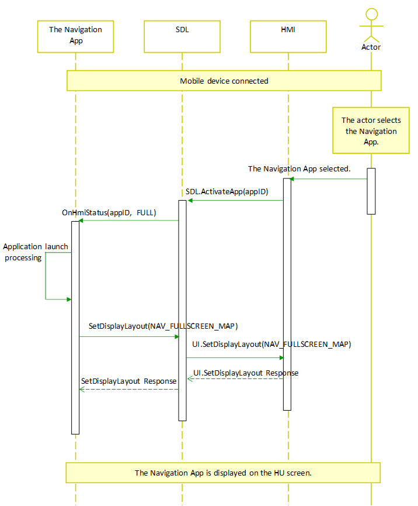
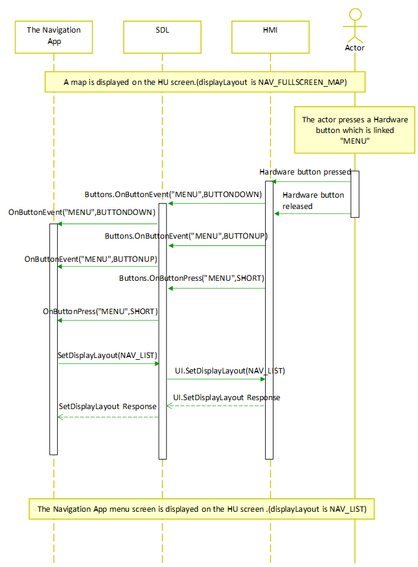
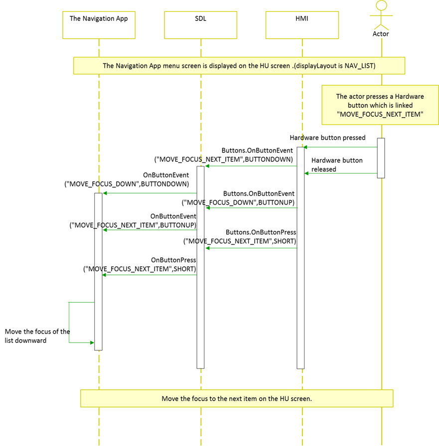

# Add ButtonName to use hardware buttons with shortcuts

* Proposal: [SDL-NNNN](NNNN-spec-add-ButtonName-to-use-hardware-buttons-with-shortcuts.md)
* Author: Kana Matsushina, Marco Kok
* Status: **Awaiting review**
* Impacted Platforms: iOS, Android, Core, RPC

## Introduction

This proposal adds a new function (ButtonName) to use the hardware button installed in the vehicle as a shortcut key.

## Motivation

This proposal is a proposal for adding a hardware button installed in the vehicle to a function (ButtonName).
Hardware buttons are not only buttons but also general physical input devices installed in vehicles such as rotary encoders.
The application configures the screen during the projection mode, so the Head Unit (HU) can not grasp the contents displayed on the screen.
Also, the applications that use the projection mode should be limited to the navigation applications and the OEM applications.
Because HU does not locate a soft button on a screen, the navigation application can make content of the projection freely.
However, the functions of icons and buttons that can be displayed on the projection should be limited to the basic functions added this time.
If there is a function other than the function to be added, it should be expressed as a menu item.
By linking the function (ButtonName) to the hardware button, the user can instruct the navigation application without displaying the soft button on the HU's UI.
The contents of the instruction are ZoomIn / ZoomOut, Back etc.
Adding this function improves the operability and appearance of applications that use the projection mode.
The function to add is as follows.

* Display Current Location
  * This is the function to set your current location in the center of the map. By adding this function, the users will be able to easily center their current location.
* Zoom In
  * This function is for enlarging the map screen when using the Navigation App.
* Zoom Out
  * It is a function to reduce the map screen when using the Navigation App.
* Map Scroll Up
  * This is a function to scroll up on the map screen when using the Navigation App.
* Map Scroll Down
  * This function is for scrolling down on the map screen when using the Navigation App.
* Map Scroll Left
  * This function is for scrolling to the left on the map screen when using the Navigation App.
* Map Scroll Right
  * This function is for scrolling to the right on the map screen when using the Navigation App.
* Move Focus Next Item
  * It is a function for moving the focus to next item on a screen (list screen) other than the map screen.
* Move Focus Previous Item
  * It is a function for moving the focus to previous item on a screen (list screen) other than the map screen.
* Back
  * It is a function for back to the previous screen.
* Menu
  * When using the Navigation App, this function has the following usage.
    * Displaying current location: Transit to Menu screen of the Navigation App.
    * Maps scrolling: Transit to the corresponding Menu screen like destination setting.

Also, in order to assign multiple functions to one hardware button, use displayLayout as below.

* NAV_FULLSCREEN_MAP : Top layer screen (map screen) of the Navigation App
* NAV_LIST：Screen besides the Top layer of the Navigation App (List screen such as Menu)

In the Navigation App, it is necessary to notify the HU of "NAV_FULLSCREEN_MAP" or "NAV_LIST" at the timing when the display contents change.

The use of "NAV_FULLSCREEN_MAP" and "NAV_LIST" is as follows.

* The Navigation App start sequence (NAV_FULLSCREEN_MAP notice sequence)

  

* ButtonName notification sequence when "ZOOM_IN" is selected (NAV_FULLSCREEN_MAP)

  

* ButtonName notification sequence when "MENU" is selected (NAV_LIST notice sequence)

  

* ButtonName notification sequence when "MOVE_FOCUS_DOWN" is selected (NAV_LIST)

  

## Proposed solution

In order to realize these proposals, we add a new ButtonName. Make changes to the three platforms (Core, iOS, Android).

### Spec Impact:

MOBILE_API.xml

```xml
...
<enum name="ButtonName">
    ...
        <!-- Buttons for mobile navigation apps -->
            <!-- 
            * These buttons are used to manipulate the mobile navigation application with hardware keys.
            * These buttons can be used when the mobile navigation application sets "NAV_FULLSCREEN_MAP" or "NAV_LIST" as displayLayout.
            -->
        <element name="DISPLAY_CURRENT_LOCATION" since="x.x">
            <warning>
                Notify "DISPLAY_CURRENT_LOCATION" function irrespective of the set displayLayout.
                When this function is notified, please display the current location in the center of the screen regardless of the display status.
            </warning>
        </element>
        <element name="ZOOM_IN" since="x.x">
            <warning>
                It may be notified when displayLayout is set to "NAV_FULLSCREEN_MAP".
            </warning>
        </element>
        <element name="ZOOM_OUT" since="x.x">
            <warning>
                It may be notified when displayLayout is set to "NAV_FULLSCREEN_MAP".
            </warning>
        </element>
        <element name="MAP_SCROLL_UP" since="x.x">
             <warning>
                It may be notified when displayLayout is set to "NAV_FULLSCREEN_MAP".
            </warning>
        </element>
        <element name="MAP_SCROLL_DOWN" since="x.x">
            <warning>
                It may be notified when displayLayout is set to "NAV_FULLSCREEN_MAP".
            </warning>
        </element>
        <element name="MAP_SCROLL_LEFT" since="x.x">
            <warning>
                It may be notified when displayLayout is set to "NAV_FULLSCREEN_MAP".
            </warning>
        </element>
        <element name="MAP_SCROLL_RIGHT" since="x.x">
            <warning>
                It may be notified when displayLayout is set to "NAV_FULLSCREEN_MAP".
            </warning>
        </element>
        <element name="MOVE_FOCUS_NEXT_ITEM" since="x.x">
            <warning>
                It may be notified when displayLayout is set to "NAV_LIST".
            </warning>
        </element>
        <element name="MOVE_FOCUS_PREVIOUS_ITEM" since="x.x">
            <warning>
                It may be notified when displayLayout is set to "NAV_LIST".
            </warning>
        </element>
        <element name="BACK" since="x.x">
            <warning>
                It may be notified when displayLayout is set to "NAV_LIST".
            </warning>
        </element>
        <element name="MENU" since="x.x">
            <warning>
                It may be notified when displayLayout is set to "NAV_FULLSCREEN_MAP".
                When this function is notified, it is necessary for the application to consider the function distribution.
                For example, when this function is notified during map scrolling, it is necessary to display the destination setting item of Menu.
            </warning>
        </element>
    </enum>
...
```

### iOS Impact:

SDLButtonName.h:

```objc
@import "SDLEnum.h"
...
/**
 * Represents a display current location button.
 */
extern SDLButtonName const SDLButtonNameDisplayCurrentLocation;

/**
 * Represents a zoom in button.
 */
extern SDLButtonName const SDLButtonNameZoomIn;

/**
 * Represents a zoom out button.
 */
extern SDLButtonName const SDLButtonNameZoomOut;

/**
 * Represents a map scroll up button.
 */
extern SDLButtonName const SDLButtonNameMapScrollUp;

/**
 * Represents a map scroll down button.
 */
extern SDLButtonName const SDLButtonNameMapScrollDown;

/**
 * Represents a map scroll left button.
 */
extern SDLButtonName const SDLButtonNameMapScrollLeft;

/**
 * Represents a map scroll right button.
 */
extern SDLButtonName const SDLButtonNameMapScrollRight;

/**
 * Represents a move focus next item button.
 */
extern SDLButtonName const SDLButtonNameMoveFocusNextItem;

/**
 * Represents a move focus previous item button.
 */
extern SDLButtonName const SDLButtonNameMoveFocusPreviousItem;

/**
 * Represents a back button.
 */
extern SDLButtonName const SDLButtonNameBack;

/**
 * Represents a menu button.
 */
extern SDLButtonName const SDLButtonNameMenu;

@end
```

SDLButtonName.m:

```objc
...
SDLButtonName const SDLButtonNameDisplayCurrentLocation = @"DISPLAY_CURRENT_LOCATION";
SDLButtonName const SDLButtonNameZoomIn = @"ZOOM_IN";
SDLButtonName const SDLButtonNameZoomOut = @"ZOOM_OUT";
SDLButtonName const SDLButtonNameMapScrollUp = @"MAP_SCROLL_UP";
SDLButtonName const SDLButtonNameMapScrollDown = @"MAP_SCROLL_DOWN";
SDLButtonName const SDLButtonNameMapScrollLeft = @"MAP_SCROLL_LEFT";
SDLButtonName const SDLButtonNameMapScrollRight = @"MAP_SCROLL_RIGHT";
SDLButtonName const SDLButtonNameMoveFocusUp = @"MOVE_FOCUS_NEXT_ITEM";
SDLButtonName const SDLButtonNameMoveFocusDown = @"MOVE_FOCUS_PREVIOUS_ITEM";
SDLButtonName const SDLButtonNameBack = @"BACK";
SDLButtonName const SDLButtonNameMenu = @"MENU";

```

### Android Impact:

ButtonName.java

```java
public enum ButtonName {
    ...,
    /**
     * Represents the display current location button.
     * 
     * @since SmartDeviceLink x.x
     */
    DISPLAY_CURRENT_LOCATION,
    /**
     * Represents the zoom in button.
     * 
     * @since SmartDeviceLink x.x
     */
    ZOOM_IN,
    /**
     * Represents the zoom out button.
     * 
     * @since SmartDeviceLink x.x
     */
    ZOOM_OUT,
    /**
     * Represents the map scroll up button.
     * 
     * @since SmartDeviceLink x.x
     */
    MAP_SCROLL_UP,
    /**
     * Represents the map scroll down button.
     * 
     * @since SmartDeviceLink x.x
     */
    MAP_SCROLL_DOWN,
    /**
     * Represents the map scroll left button.
     * 
     * @since SmartDeviceLink x.x
     */
    MAP_SCROLL_LEFT,
    /**
     * Represents the map scroll right button.
     * 
     * @since SmartDeviceLink x.x
     */
    MAP_SCROLL_RIGHT,
    /**
     * Represents the move focus up button.
     * 
     * @since SmartDeviceLink x.x
     */
    MOVE_FOCUS_NEXT_ITEM,
    /**
     * Represents the move focus next item button.
     * 
     * @since SmartDeviceLink x.x
     */
    MOVE_FOCUS_PREVIOUS_ITEM,
    /**
     * Represents the move focus previous item button.
     * 
     * @since SmartDeviceLink x.x
     */
    BACK,
    /**
     * Represents the menu button.
     * 
     * @since SmartDeviceLink x.x
     */
    MENU,
    ;
    ...
}
```

### Core Impact (Definitely much more):

hmi_capabilities_impl.cc

```c
...
  button_enum_name.insert(
      std::make_pair(std::string("DISPLAY_CURRENT_LOCATION"), hmi_apis::Common_ButtonName::DISPLAY_CURRENT_LOCATION));
  button_enum_name.insert(
      std::make_pair(std::string("ZOOM_IN"), hmi_apis::Common_ButtonName::ZOOM_IN));
  button_enum_name.insert(
      std::make_pair(std::string("ZOOM_OUT"), hmi_apis::Common_ButtonName::ZOOM_OUT));
  button_enum_name.insert(
      std::make_pair(std::string("MAP_SCROLL_UP"), hmi_apis::Common_ButtonName::MAP_SCROLL_UP));
  button_enum_name.insert(
      std::make_pair(std::string("MAP_SCROLL_DOWN"), hmi_apis::Common_ButtonName::MAP_SCROLL_DOWN));
  button_enum_name.insert(
      std::make_pair(std::string("MAP_SCROLL_LEFT"), hmi_apis::Common_ButtonName::MAP_SCROLL_LEFT));
  button_enum_name.insert(
      std::make_pair(std::string("MAP_SCROLL_RIGHT"), hmi_apis::Common_ButtonName::MAP_SCROLL_RIGHT));
  button_enum_name.insert(
      std::make_pair(std::string("MOVE_FOCUS_NEXT_ITEM"), hmi_apis::Common_ButtonName::MOVE_FOCUS_NEXT_ITEM));
  button_enum_name.insert(
      std::make_pair(std::string("MOVE_FOCUS_PREVIOUS_ITEM"), hmi_apis::Common_ButtonName::MOVE_FOCUS_PREVIOUS_ITEM));
  button_enum_name.insert(
      std::make_pair(std::string("BACK"), hmi_apis::Common_ButtonName::BACK));
  button_enum_name.insert(
      std::make_pair(std::string("MENU"), hmi_apis::Common_ButtonName::MENU));

```

HMI_API.xml

```xml
...
<enum name="ButtonName">
    ...
    <!-- Buttons for mobile navigation apps -->
        <!-- 
         * These buttons are used to manipulate the mobile navigation application with hardware keys.
         * These buttons can be used when the mobile navigation application sets "NAV_FULLSCREEN_MAP" or "NAV_LIST" as displayLayout.
         -->
    <element name="DISPLAY_CURRENT_LOCATION">
        <warning>
            Notify "DISPLAY_CURRENT_LOCATION" function irrespective of the set displayLayout.
            When this function is notified, please display the current location in the center of the screen regardless of the display status.
        </warning>
    </element>
    <element name="ZOOM_IN">
        <warning>
            It may be notified when displayLayout is set to "NAV_FULLSCREEN_MAP".
        </warning>
    </element>
    <element name="ZOOM_OUT">
        <warning>
            It may be notified when displayLayout is set to "NAV_FULLSCREEN_MAP".
        </warning>
    </element>
    <element name="MAP_SCROLL_UP">
        <warning>
            It may be notified when displayLayout is set to "NAV_FULLSCREEN_MAP".
        </warning>
    </element>
    <element name="MAP_SCROLL_DOWN">
        <warning>
            It may be notified when displayLayout is set to "NAV_FULLSCREEN_MAP".
        </warning>
    </element>
    <element name="MAP_SCROLL_LEFT">
        <warning>
            It may be notified when displayLayout is set to "NAV_FULLSCREEN_MAP".
        </warning>
    </element>
    <element name="MAP_SCROLL_RIGHT">
        <warning>
            It may be notified when displayLayout is set to "NAV_FULLSCREEN_MAP".
        </warning>
    </element>
    <element name="MOVE_FOCUS_NEXT_ITEM">
        <warning>
            It may be notified when displayLayout is set to "NAV_LIST".
        </warning>
    </element>
    <element name="MOVE_FOCUS_PREVIOUS_ITEM">
        <warning>
            It may be notified when displayLayout is set to "NAV_LIST".
        </warning>
    </element>
    <element name="BACK">
        <warning>
            It may be notified when displayLayout is set to "NAV_LIST".
        </warning>
    </element>
    <element name="MENU" />
        <warning>
            It may be notified when displayLayout is set to "NAV_FULLSCREEN_MAP".
            When this function is notified, it is necessary for the application to consider the function distribution.
            For example, when this function is notified during map scrolling, it is necessary to display the destination setting item of Menu.
        </warning>
    </element>
</enum>
...
```

## Potential downsides

There is no problem assumed in this proposal.

## Impact on existing code

This change will not affect previous versions of SDL.

## Alternatives considered

Instead of notifying the functions, HU notifies the hardware button information  to the application directory.
Then the application works by itself.
For example,
* Rotary Switch Rotate Right
* Rotary Switch Rotate Left
* Rotary Switch Slide Upward
* Rotary Switch Rotate Downward
* Rotary Switch Rotate Rightward
* Rotary Switch Rotate Leftward, etc.

Potential downsides are that 1) it's hard to define all the hardware buttons which all the OEM have, 2) the OEMs are not able to control the user experiences nor the unified UI behavior between other similar applitations because only the application vendor knows how to deal the hardware button.

## Appendix

In order to realize this proposal, the HU needs to read the information of the hardware button equipped in the vehicle, and dispose that button as appropriate to ButtonName.
As an example, let's take a look at the keyboard key of the PC as a hardware button installed in the vehicle, read it with sdl_hmi, and introduce a mechanism to notify the mobile application of ButtonName without going through the soft button.

The base code is as follows.  
HU：sdl_hmi (`https://github.com/smartdevicelink/sdl_hmi`) commit id:2db0b73444ac46db72ffe45e1eae166836be4a4a

It is assumed that ButtonName to be notified is subscribed

Correct so that the press information of the PC key is notified to the sdl_hmi file (src / app / view / navigationAppView.js).

```js
...

SDL.NavigationAppView = Em.ContainerView.create(
  {
…(abb)…
    didInsertElement: function() {
      return this.$().attr({ tabindex: 1 }), this.$().focus();
    },
…(abb)…
    keyDown: function(event) {
      // Describe processing when the PC key is pressed
      if(event.keyCode == 49)
      {
          FFW.Buttons.buttonEvent('BUTTON_NAME','BUTTONDOWN');
      }
    },
    keyUp: function(event) {
      // Since the key of the PC has been released, BUTTONUP is notified to the Mobile application
      if(event.keyCode == 49)
      {
          FFW.Buttons.buttonEvent('BUTTON_NAME','BUTTONUP');
          FFW.Buttons.buttonPressed('BUTTON_NAME','SHORT');
      }
    },
…(abb)…
  }
);

...
```

Using sdl_hmi with the above modification, keyDown will be called when you press the key on the PC keyboard. Then release key to call keyUp. By calling FFW.Buttons.buttonEvent () at each timing, you can inform the mobile application of ButtonName.
