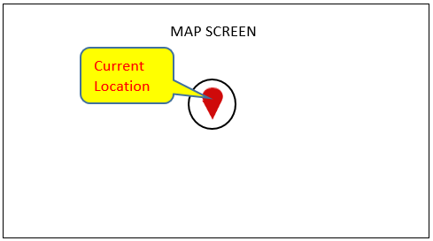
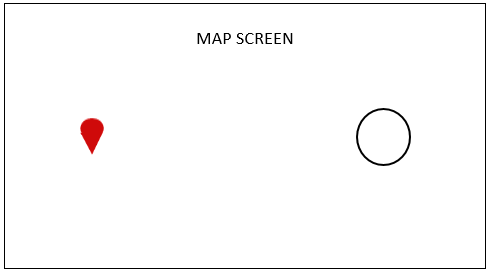
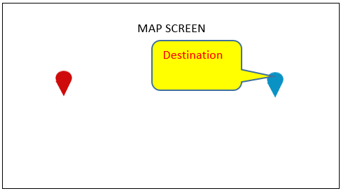

# Manuplating Projection App via Hardware Buttons

* Proposal: [SDL-NNNN](NNNN-spec-manuplating-projection-app-via-hardware-buttons.md)
* Author: Marco Kok, Kana Matsushima
* Status: **Awaiting review**
* Impacted Platforms: iOS, Android, Core, RPC

## Introduction

This proposal is to add a new functions (ButtonName) to use the hardware buttons as a shortcut key during projection mode app.

## Motivation

This proposal is for linking the functions (ButtonName) to the hardware button installed in the vehicle.
Hardware buttons are not only buttons but also physical input devices such as rotary encoders.
By linking, you can instruct the mobile application without displaying a User Interface(UI) button on the Head Unit(HU).
The contents of the instruction are Zoom-In / Zoom-Out, Back etc.
Since UI buttons don't need to be displayed, car manufacturers and developers do not have to worry about the display position of the UI buttons.
The Mobile application assumes the Projection Mode App such as Navigation App.  

### Proposed ButtonName/ Function

| ButtonName/ Function | NAV_FULLSCREEN_MAP | NAV_LIST |
|:---------- |:----------- |:----------- |
|`DISPLAY_CURRENT_LOCATION`|To set your current location in the center of the map. By adding this function, users will be able to easily center their current location.|-|
|`ZOOM_IN`|To enlarge the map screen when using the Navigation App.|-|
|`ZOOM_OUT`|To reduce the map screen when using the Navigation App.|-|
|`MAP_SCROLL_UP`|To scroll up on the map screen when using the Navigation App.|-|
|`MAP_SCROLL_DOWN`|To scroll down on the map screen when using the Navigation App.|-|
|`MAP_SCROLL_LEFT`|To scroll to the left on the map screen when using the Navigation App.|-|
|`MAP_SCROLL_RIGHT`|To scroll to the right on the map screen when using the Navigation App.|-|
|`MOVE_FOCUS_UP`|-|To move the focus upward on a List or Icon screen. (Other than the map screen)|
|`MOVE_FOCUS_DOWN`|-|To move the focus downward on a List or Icon screen. (Other than the map screen)|
|`MOVE_FOCUS_LEFT`|-|To move the focus left on a List or Icon screen. (Other than the map screen)|
|`MOVE_FOCUS_RIGHT`|-|To move the focus right on a List or Icon screen. (Other than the map screen)|
|`BACK`|To go back to the previous screen.|To go back to the previous screen.|
|`SWITCH_DISPLAY_MODE`|To switch the map screen display mode (eg 2D / 3D, north up / head up) when using the Navigation App.|-|
|`SET_A_DESTINATION`|To scroll on the map screen and select the place in the center of the screen to set the place as the destinationwhen using the Navigation App.|-|  

Explanation about "SET_A_DESTINATION" as follows;

  The figure below shows the focus at the current position.

  

  Scroll to the right from your current location.

  

  After scrolling to the right, if you set the "destination setting", the blue mark is set as the destination.

  

## Proposed solution

In order to realize these proposals, add those new ButtonName. Make changes to the three platforms (Core, iOS, Android).

### Spec Impact:

MOBILE_API.xml

```xml
...
<enum name="ButtonName">
    ...
        <!-- Buttons for mobile navigation apps -->
            <!-- 
            * These buttons are used to manipulate the mobile navigation application with hardware keys.
            * These buttons can be used when the mobile navigation application sets "NAV_FULLSCREEN_MAP" or "NAV_LIST" as displayLayout.
            -->
        <element name="DISPLAY_CURRENT_LOCATION" since="x.x">
        <warning>
            When using this button, please set "NAV_FULLSCREEN_MAP" as displayLayout from the Mobile application.
        </warning>
    </element>
    <element name="ZOOM_IN" since="x.x" />
        **<warning>
            **When using this button, please set "NAV_FULLSCREEN_MAP" as displayLayout from the Mobile application.
        **</warning>
    **</element>
    <element name="ZOOM_OUT" since="x.x" />
        **<warning>
            **When using this button, please set "NAV_FULLSCREEN_MAP" as displayLayout from the Mobile application.
        **</warning>
    **</element>
    <element name="MAP_SCROLL_UP" since="x.x">
        <warning>
            When using this button, please set "NAV_FULLSCREEN_MAP" as displayLayout from the Mobile application.
        </warning>
    </element>
    <element name="MAP_SCROLL_DOWN" since="x.x">
        <warning>
            When using this button, please set "NAV_FULLSCREEN_MAP" as displayLayout from the Mobile application.
        </warning>
    </element>
    <element name="MAP_SCROLL_LEFT" since="x.x">
        <warning>
            When using this button, please set "NAV_FULLSCREEN_MAP" as displayLayout from the Mobile application.
        </warning>
    </element>
    <element name="MAP_SCROLL_RIGHT" since="x.x">
        <warning>
            When using this button, please set "NAV_FULLSCREEN_MAP" as displayLayout from the Mobile application.
        </warning>
    </element>
    <element name="MOVE_FOCUS_UP" since="x.x">
        <warning>
            When using this button, please set "NAV_LIST" as displayLayout from the Mobile application.
        </warning>
    </element>
    <element name="MOVE_FOCUS_DOWN" since="x.x">
        <warning>
            When using this button, please set "NAV_LIST" as displayLayout from the Mobile application.
        </warning>
    </element>
    <element name="MOVE_FOCUS_LEFT" since="x.x">
        <warning>
            When using this button, please set "NAV_LIST" as displayLayout from the Mobile application.
        </warning>
    </element>
    <element name="MOVE_FOCUS_RIGHT" since="x.x">
        <warning>
            When using this button, please set "NAV_LIST" as displayLayout from the Mobile application.
        </warning>
    </element>
    <element name="BACK" since="x.x" />
        **<warning>
            **When using this button, please set "NAV_FULLSCREEN_MAP" and "NAV_LIST" as displayLayout from the Mobile application.
        **</warning>
    **</element>
    <element name="SWITCH_DISPLAY_MODE" since="x.x">
        <warning>
            When using this button, please set "NAV_FULLSCREEN_MAP" as displayLayout from the Mobile application.
        </warning>
    </element>
    <element name="SET_A_DESTINATION" since="x.x">
        <warning>
            When using this button, please set "NAV_FULLSCREEN_MAP" as displayLayout from the Mobile application.
        </warning>
    </element>
</enum>
...
```

### iOS Impact:

SDLButtonName.h:

```objc
@import "SDLEnum.h"
...
/**
 * Represents a display current location button.
 */
extern SDLButtonName const SDLButtonNameDisplayCurrentLocation;

/**
 * Represents a zoom in button.
 */
extern SDLButtonName const SDLButtonNameZoomIn;

/**
 * Represents a zoom out button.
 */
extern SDLButtonName const SDLButtonNameZoomOut;

/**
 * Represents a map scroll up button.
 */
extern SDLButtonName const SDLButtonNameMapScrollUp;

/**
 * Represents a map scroll down button.
 */
extern SDLButtonName const SDLButtonNameMapScrollDown;

/**
 * Represents a map scroll left button.
 */
extern SDLButtonName const SDLButtonNameMapScrollLeft;

/**
 * Represents a map scroll right button.
 */
extern SDLButtonName const SDLButtonNameMapScrollRight;

/**
 * Represents a move focus up button.
 */
extern SDLButtonName const SDLButtonNameMoveFocusUp;

/**
 * Represents a move focus down button.
 */
extern SDLButtonName const SDLButtonNameMoveFocusDown;

/**
 * Represents a move focus left button.
 */
extern SDLButtonName const SDLButtonNameMoveFocusLeft;

/**
 * Represents a move focus right button.
 */
extern SDLButtonName const SDLButtonNameMoveFocusRight;

/**
 * Represents a back button.
 */
extern SDLButtonName const SDLButtonNameBack;

/**
 * Represents a switch display mode button.
 */
extern SDLButtonName const SDLButtonNameSwitchDisplayMode;

/**
 * Represents a set a destination button.
 */
extern SDLButtonName const SDLButtonNameSetADestination;

@end
```

SDLButtonName.m:

```objc
...
SDLButtonName const SDLButtonNameDisplayCurrentLocation = @"DISPLAY_CURRENT_LOCATION";
SDLButtonName const SDLButtonNameZoomIn = @"ZOOM_IN";
SDLButtonName const SDLButtonNameZoomOut = @"ZOOM_OUT";
SDLButtonName const SDLButtonNameMapScrollUp = @"MAP_SCROLL_UP";
SDLButtonName const SDLButtonNameMapScrollDown = @"MAP_SCROLL_DOWN";
SDLButtonName const SDLButtonNameMapScrollLeft = @"MAP_SCROLL_LEFT";
SDLButtonName const SDLButtonNameMapScrollRight = @"MAP_SCROLL_RIGHT";
SDLButtonName const SDLButtonNameMoveFocusUp = @"MOVE_FOCUS_UP";
SDLButtonName const SDLButtonNameMoveFocusDown = @"MOVE_FOCUS_DOWN";
SDLButtonName const SDLButtonNameMoveFocusLeft = @"MOVE_FOCUS_LEFT";
SDLButtonName const SDLButtonNameMoveFocusRight = @"MOVE_FOCUS_RIGHT";
SDLButtonName const SDLButtonNameBack = @"BACK";
SDLButtonName const SDLButtonNameSwitchDisplayMode = @"SWITCH_DISPLAY_MODE";
SDLButtonName const SDLButtonNameSetADestination = @"SET_A_DESTINATION";

```

### Android Impact:

ButtonName.java

```java
public enum ButtonName {
    ...,
    /**
     * Represents the display current location button.
     * 
     * @since SmartDeviceLink x.x
     */
    DISPLAY_CURRENT_LOCATION,
    /**
     * Represents the zoom in button.
     * 
     * @since SmartDeviceLink x.x
     */
    ZOOM_IN,
    /**
     * Represents the zoom out button.
     * 
     * @since SmartDeviceLink x.x
     */
    ZOOM_OUT,
    /**
     * Represents the map scroll up button.
     * 
     * @since SmartDeviceLink x.x
     */
    MAP_SCROLL_UP,
    /**
     * Represents the map scroll down button.
     * 
     * @since SmartDeviceLink x.x
     */
    MAP_SCROLL_DOWN,
    /**
     * Represents the map scroll left button.
     * 
     * @since SmartDeviceLink x.x
     */
    MAP_SCROLL_LEFT,
    /**
     * Represents the map scroll right button.
     * 
     * @since SmartDeviceLink x.x
     */
    MAP_SCROLL_RIGHT,
    /**
     * Represents the move focus up button.
     * 
     * @since SmartDeviceLink x.x
     */
    MOVE_FOCUS_UP,
    /**
     * Represents the move focus down button.
     * 
     * @since SmartDeviceLink x.x
     */
    MOVE_FOCUS_DOWN,
    /**
     * Represents the move focus left button.
     * 
     * @since SmartDeviceLink x.x
     */
    MOVE_FOCUS_LEFT,
    /**
     * Represents the move focus right button.
     * 
     * @since SmartDeviceLink x.x
     */
    MOVE_FOCUS_RIGHT,
    /**
     * Represents the back button.
     * 
     * @since SmartDeviceLink x.x
     */
    BACK,
    /**
     * Represents the switch display mode button.
     * 
     * @since SmartDeviceLink x.x
     */
    SWITCH_DISPLAY_MODE,
    /**
     * Represents the set a destination button.
     * 
     * @since SmartDeviceLink x.x
     */
    SET_A_DESTINATION,
    ;
    ...
}
```

### Core Impact (Definitely much more):

hmi_capabilities_impl.cc

```c
...
  button_enum_name.insert(
      std::make_pair(std::string("DISPLAY_CURRENT_LOCATION"), hmi_apis::Common_ButtonName::DISPLAY_CURRENT_LOCATION));
  button_enum_name.insert(
      std::make_pair(std::string("ZOOM_IN"), hmi_apis::Common_ButtonName::ZOOM_IN));
  button_enum_name.insert(
      std::make_pair(std::string("ZOOM_OUT"), hmi_apis::Common_ButtonName::ZOOM_OUT));
  button_enum_name.insert(
      std::make_pair(std::string("MAP_SCROLL_UP"), hmi_apis::Common_ButtonName::MAP_SCROLL_UP));
  button_enum_name.insert(
      std::make_pair(std::string("MAP_SCROLL_DOWN"), hmi_apis::Common_ButtonName::MAP_SCROLL_DOWN));
  button_enum_name.insert(
      std::make_pair(std::string("MAP_SCROLL_LEFT"), hmi_apis::Common_ButtonName::MAP_SCROLL_LEFT));
  button_enum_name.insert(
      std::make_pair(std::string("MAP_SCROLL_RIGHT"), hmi_apis::Common_ButtonName::MAP_SCROLL_RIGHT));
  button_enum_name.insert(
      std::make_pair(std::string("MOVE_FOCUS_UP"), hmi_apis::Common_ButtonName::MOVE_FOCUS_UP));
  button_enum_name.insert(
      std::make_pair(std::string("MOVE_FOCUS_DOWN"), hmi_apis::Common_ButtonName::MOVE_FOCUS_DOWN));
  button_enum_name.insert(
      std::make_pair(std::string("MOVE_FOCUS_LEFT"), hmi_apis::Common_ButtonName::MOVE_FOCUS_LEFT));
  button_enum_name.insert(
      std::make_pair(std::string("MOVE_FOCUS_RIGHT"), hmi_apis::Common_ButtonName::MOVE_FOCUS_RIGHT));
  button_enum_name.insert(
      std::make_pair(std::string("BACK"), hmi_apis::Common_ButtonName::BACK));
  button_enum_name.insert(
      std::make_pair(std::string("SWITCH_DISPLAY_MODE"), hmi_apis::Common_ButtonName::SWITCH_DISPLAY_MODE));
  button_enum_name.insert(
      std::make_pair(std::string("SET_A_DESTINATION"), hmi_apis::Common_ButtonName::SET_A_DESTINATION));

```

HMI_API.xml

```xml
...
<enum name="ButtonName">
    ...
    <!-- Buttons for mobile navigation apps -->
        <!-- 
        * These buttons are used to manipulate the mobile navigation application with hardware keys.
        * These buttons can be used when the mobile navigation application sets "NAV_FULLSCREEN_MAP" or "NAV_LIST" as displayLayout.
        -->
    <element name="DISPLAY_CURRENT_LOCATION">
        <warning>
            When using this button, please set "NAV_FULLSCREEN_MAP" as displayLayout from the Mobile application.
        </warning>
    </element>
    <element name="ZOOM_IN" />
        **<warning>
            **When using this button, please set "NAV_FULLSCREEN_MAP" as displayLayout from the Mobile application.
        **</warning>
    **</element>
    <element name="ZOOM_OUT" />
        **<warning>
            **When using this button, please set "NAV_FULLSCREEN_MAP" as displayLayout from the Mobile application.
            **</warning>
    **</element>
    <element name="MAP_SCROLL_UP">
        <warning>
            When using this button, please set "NAV_FULLSCREEN_MAP" as displayLayout from the Mobile application.
        </warning>
    </element>
    <element name="MAP_SCROLL_DOWN">
        <warning>
            When using this button, please set "NAV_FULLSCREEN_MAP" as displayLayout from the Mobile application.
        </warning>
    </element>
    <element name="MAP_SCROLL_LEFT">
        <warning>
            When using this button, please set "NAV_FULLSCREEN_MAP" as displayLayout from the Mobile application.
        </warning>
    </element>
    <element name="MAP_SCROLL_RIGHT">
        <warning>
            When using this button, please set "NAV_FULLSCREEN_MAP" as displayLayout from the Mobile application.
        </warning>
    </element>
    <element name="MOVE_FOCUS_UP">
        <warning>
            When using this button, please set "NAV_LIST" as displayLayout from the Mobile application.
        </warning>
    </element>
    <element name="MOVE_FOCUS_DOWN">
        <warning>
            When using this button, please set "NAV_LIST" as displayLayout from the Mobile application.
        </warning>
    </element>
    <element name="MOVE_FOCUS_LEFT">
        <warning>
            When using this button, please set "NAV_LIST" as displayLayout from the Mobile application.
        </warning>
    </element>
    <element name="MOVE_FOCUS_RIGHT">
        <warning>
            When using this button, please set "NAV_LIST" as displayLayout from the Mobile application.
        </warning>
    </element>
    <element name="BACK" />
        **<warning>
            **When using this button, please set "NAV_FULLSCREEN_MAP" and "NAV_LIST" as displayLayout from the Mobile application.
        **</warning>
    **</element>
    <element name="SWITCH_DISPLAY_MODE">
        <warning>
            When using this button, please set "NAV_FULLSCREEN_MAP" as displayLayout from the Mobile application.
        </warning>
    </element>
    <element name="SET_A_DESTINATION">
        <warning>
            When using this button, please set "NAV_FULLSCREEN_MAP" as displayLayout from the Mobile application.
        </warning>
    </element>
</enum>
...
```

## Potential downsides

There is no problem assumed in this proposal.

## Impact on existing code

This change will not affect previous versions of SDL.

## Alternatives considered

None.

## Appendix

In order to realize this proposal, the HU needs to read the information of the hardware button equipped in the vehicle, and dispose that button as appropriate to ButtonName.
This is an example for the mechanism, consider the keyboard key of the PC as a hardware button installed in the vehicle, read it with sdl_hmi, and notify the mobile application of ButtonName without placing the UI button(soft button).

The base code is as follows.  
HU：sdl_hmi (`https://github.com/smartdevicelink/sdl_hmi`) commit id:2db0b73444ac46db72ffe45e1eae166836be4a4a

It is assumed that ButtonName to be notified is subscribed.

Correct so that the press information of the PC key linked "DISPLAY_CURRENT_LOCATION" in this case is notified to the sdl_hmi file (src / app / view / navigationAppView.js).

```js
...

SDL.NavigationAppView = Em.ContainerView.create(
  {
…(abb)…
    didInsertElement: function() {
      return this.$().attr({ tabindex: 1 }), this.$().focus();
    },
…(abb)…
    keyDown: function(event) {
      // Describe processing when the PC key is pressed
      if(event.keyCode == 49)
      {
          FFW.Buttons.buttonEvent('DISPLAY_CURRENT_LOCATION','BUTTONDOWN');
      }
    },
    keyUp: function(event) {
      // Since the key of the PC has been released, BUTTONUP is notified to the Mobile application
      if(event.keyCode == 49)
      {
          FFW.Buttons.buttonEvent('DISPLAY_CURRENT_LOCATION','BUTTONUP');
          FFW.Buttons.buttonPressed('DISPLAY_CURRENT_LOCATION','SHORT');
      }
    },
…(abb)…
  }
);

...
```

Using sdl_hmi with the above modification, keyDown will be called when you press the key on the PC keyboard. Then release key to call keyUp. By calling FFW.Buttons.buttonEvent () at each timing, you can inform the mobile application of ButtonName.
